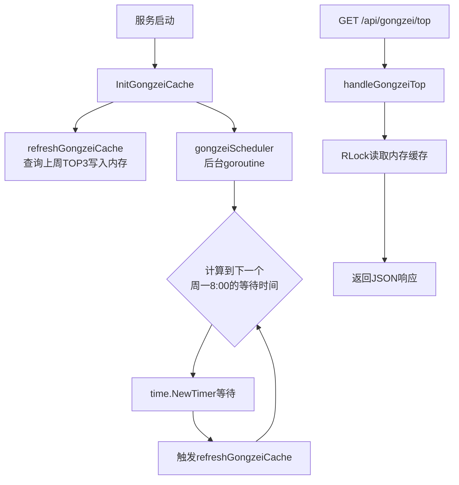
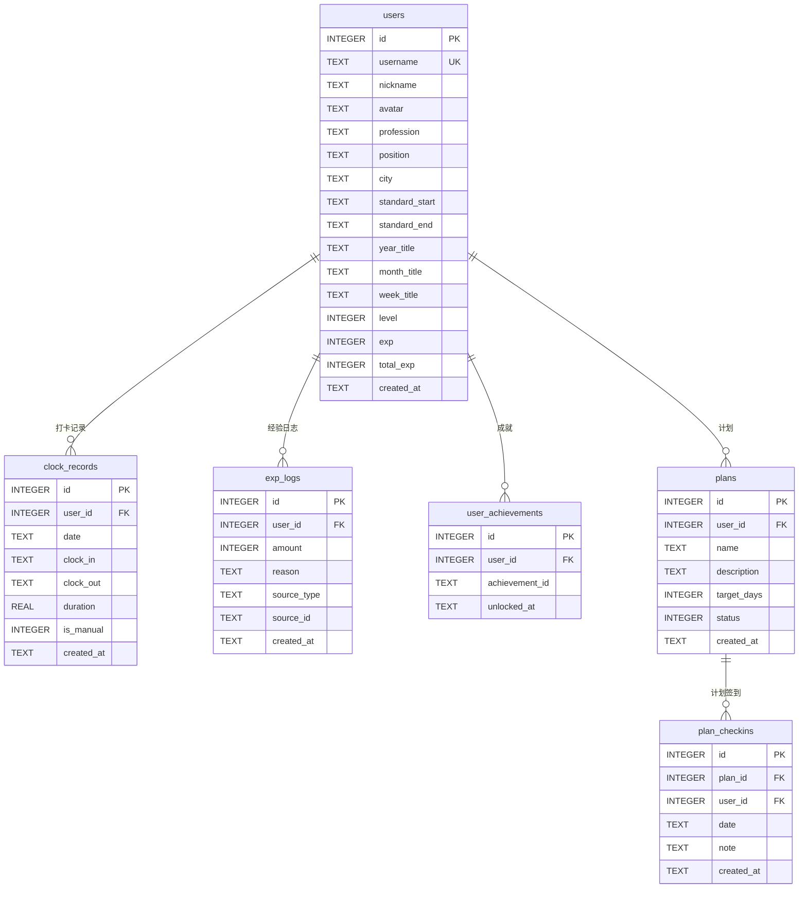

# MyWorker 功能迭代计划 v1.0

> 📅 更新时间：2026-04-24
> 📦 涉及版本：v2（等级/经验/成就）、v3（防重复约束）

---

## 一、功能概述

本次迭代围绕 **用户激励体系** 和 **个人中心** 两大核心方向，新增了以下功能模块：

| 模块 | 说明 | 状态 |
|------|------|------|
| 🏷️ 工作风格标签 | 基于打卡时间、下班时间、工时三维度的场景化标签系统 | ✅ 已完成 |
| ⭐ 等级系统 | 15级体系，通过打卡和计划获取经验值升级 | ✅ 已完成 |
| 🏅 成就系统 | 17个成就徽章，覆盖打卡/连续/工时/计划/等级 | ✅ 已完成 |
| 👤 个人中心 | 等级卡片、数据总览、成就墙、热力图、经验日志 | ✅ 已完成 |
| 🏴 工贼榜 | 顶部流动横幅展示上周总工时TOP3 | ✅ 已完成 |
| 🐛 Bug修复 | 逻辑bug、并发问题、移动端适配 | ✅ 已完成 |

---

## 二、工作风格标签系统

### 2.1 设计思路

将原有的单维度"趣味称号"（仅基于上班打卡时间）升级为 **三维度场景化组合标签**：

| 维度 | 数据来源 | 说明 |
|------|---------|------|
| ☀️ 上班时间 | `clock_in` | 到岗时间早晚 |
| 🌙 下班时间 | `clock_out` | 离开时间早晚 |
| ⏱️ 工时 | `duration` | 当日实际工作时长 |

### 2.2 场景化匹配规则

根据三个维度的 **组合特征** 匹配特定场景标签：

| 组合条件 | 标签 | 说明 |
|---------|------|------|
| 早到(≤08:00) + 晚走(≥22:00) + 工时≥12h | 超级肝帝 🏆 | 从早肝到晚的终极卷王 |
| 晚到(≥09:30) + 晚走(≥22:00) + 工时≥12h | 深夜战士 🦇 | 夜深人静还在肝 |
| 早到(≤08:30) + 晚走(≥21:00) + 工时≥10h | 卷王之王 👑 | 全方位卷的王者 |
| 早到(≤08:30) + 正常走(≤20:00) + 工时8~10h | 高效战士 ⚔️ | 早来早走效率高 |
| 晚到(≥09:30) + 晚走(≥21:00) + 工时8~10h | 夜猫子 🦉 | 晚来晚走精神好 |
| 正常到(08:30~09:30) + 正常走(18:30~20:00) + 工时8~10h | 标准打工人 💼 | 朝九晚六标准型 |
| 晚到(≥09:30) + 正常走(≤20:00) + 工时<8h | 自由灵魂 🌈 | 来去自由的灵魂 |
| 早到(≤08:30) + 早走(≤18:30) + 工时<8h | 闪电侠 ⚡ | 来得早走得也早 |
| 任意 + 任意 + 工时<6h | 摸鱼大师 🐟 | 今天划水了 |
| 其他情况 | 敬业达人 💪 | 认真工作的每一天 |

### 2.3 周期标签

基于每日标签的统计结果，生成 **周/月/年** 三个周期的综合标签：

- **计算逻辑**：统计周期内每日标签出现频率，取出现最多的标签作为基础
- **前缀规则**：根据平均评分添加前缀

| 平均分 | 前缀 | 示例 |
|--------|------|------|
| ≥ 90 | 终极 | 终极卷王之王 🏆 |
| 80 ~ 89 | 资深 | 资深高效战士 ⭐ |
| 70 ~ 79 | （无前缀） | 标准打工人 💼 |
| 60 ~ 69 | （纯文本） | 夜猫子 |
| < 60 | 萌新 | 萌新摸鱼大师 🌱 |

### 2.4 展示位置

- **打卡面板**：今日汇总区域显示当日标签
- **个人信息**：展示本周/本月/本年标签
- **排行榜**：新增"风格榜"Tab，按标签权重排序

---

## 三、等级系统

### 3.1 等级配置（15级）

| 等级 | 称号 | 所需总经验 | 图标 |
|------|------|-----------|------|
| 1 | 实习打工人 | 0 | 🌱 |
| 2 | 初级打工人 | 50 | 🌿 |
| 3 | 正式打工人 | 150 | 🍀 |
| 4 | 资深打工人 | 350 | 🌳 |
| 5 | 高级打工人 | 650 | ⭐ |
| 6 | 精英打工人 | 1,100 | 🌟 |
| 7 | 骨干打工人 | 1,700 | 💫 |
| 8 | 专家打工人 | 2,500 | 🔥 |
| 9 | 大师打工人 | 3,500 | 💎 |
| 10 | 首席打工人 | 5,000 | 👑 |
| 11 | 传说打工人 | 7,000 | 🏆 |
| 12 | 神话打工人 | 10,000 | ⚡ |
| 13 | 不朽打工人 | 15,000 | 🌈 |
| 14 | 超越打工人 | 22,000 | 🚀 |
| 15 | 终极打工人 | 30,000 | 🎆 |

### 3.2 经验值获取规则

#### 打卡相关

| 规则 | 经验值 | 触发条件 | 防重复 |
|------|--------|---------|--------|
| 上班打卡 | +5 | 每日上班打卡 | 按日期 |
| 下班打卡 | +5 | 每日下班打卡 | 按日期 |
| 完成全天打卡 | +10 | 同日完成上下班打卡 | 按日期 |
| 早起打卡 | +5 | 08:30前打卡 | 按日期 |
| 加班奖励 | +10 | 工时≥10h | 按日期 |
| 连续打卡7天 | +30 | 连续打卡恰好达到7天 | 一次性 |
| 连续打卡30天 | +100 | 连续打卡恰好达到30天 | 一次性 |

#### 计划相关

| 规则 | 经验值 | 触发条件 | 防重复 |
|------|--------|---------|--------|
| 创建计划 | +5 | 成功创建计划 | 按计划ID |
| 计划签到 | +10 | 完成计划每日签到 | 按计划ID+日期 |
| 完成计划目标 | +20 | 签到次数达到目标天数 | 按计划ID |

### 3.3 防重复机制

使用数据库 `UNIQUE(user_id, source_type, source_id)` 约束 + `INSERT ... ON CONFLICT DO NOTHING` 原子操作，避免并发场景下的重复发放。

---

## 四、成就系统

### 4.1 成就列表（17个）

#### 打卡里程碑（5个）

| ID | 名称 | 描述 | 图标 |
|----|------|------|------|
| first_clock | 初来乍到 | 完成第一次打卡 | 🎉 |
| clock_7 | 一周坚持 | 累计打卡7天 | 📅 |
| clock_30 | 月度达人 | 累计打卡30天 | 🗓️ |
| clock_100 | 百日坚持 | 累计打卡100天 | 💯 |
| clock_365 | 全年无休 | 累计打卡365天 | 🏅 |

#### 连续打卡（3个）

| ID | 名称 | 描述 | 图标 |
|----|------|------|------|
| streak_7 | 连续七天 | 连续打卡7天 | 🔥 |
| streak_30 | 铁人意志 | 连续打卡30天 | 💪 |
| streak_100 | 百日不断 | 连续打卡100天 | ⚡ |

#### 工时成就（3个）

| ID | 名称 | 描述 | 图标 |
|----|------|------|------|
| hours_100 | 百小时 | 累计工时达100小时 | ⏰ |
| hours_500 | 五百小时 | 累计工时达500小时 | ⏱️ |
| hours_1000 | 千小时 | 累计工时达1000小时 | 🕐 |

#### 计划成就（3个）

| ID | 名称 | 描述 | 图标 |
|----|------|------|------|
| first_plan | 计划先行 | 创建第一个计划 | 🎯 |
| plan_10 | 计划达人 | 累计签到10次 | 📋 |
| plan_50 | 计划大师 | 累计签到50次 | 📊 |

#### 等级成就（3个）

| ID | 名称 | 描述 | 图标 |
|----|------|------|------|
| level_5 | 初露锋芒 | 达到5级 | ⭐ |
| level_10 | 登峰造极 | 达到10级 | 👑 |
| level_15 | 终极打工人 | 达到15级 | 🎆 |

### 4.2 解锁时机

- **打卡成就**：每次下班打卡成功后自动检查
- **计划成就**：每次创建计划或计划签到后自动检查
- **等级成就**：每次升级时自动检查

---

## 五、个人中心

### 5.1 功能模块

```
┌─────────────────────────────────────────┐
│  👤 个人中心                              │
├─────────────────────────────────────────┤
│  ┌─────────────────────────────────┐    │
│  │  等级卡片                         │    │
│  │  Lv.8 专家打工人 🔥               │    │
│  │  ████████████░░░░ 2500/3500 EXP  │    │
│  └─────────────────────────────────┘    │
│                                          │
│  ┌──────┐ ┌──────┐ ┌──────┐ ┌──────┐   │
│  │打卡天数│ │连续打卡│ │总工时  │ │日均工时│   │
│  │  42   │ │  7   │ │336.5h│ │ 8.0h │   │
│  └──────┘ └──────┘ └──────┘ └──────┘   │
│                                          │
│  🏷️ 工作风格标签                          │
│  本周: 卷王之王 👑                         │
│  本月: 资深高效战士 ⭐                      │
│  本年: 标准打工人 💼                        │
│                                          │
│  🏅 成就徽章墙                             │
│  🎉 📅 🗓️ 💯 🔥 💪 ⏰ 🎯 📋 ⭐          │
│  (已解锁 10/17)                           │
│                                          │
│  📊 打卡热力图                             │
│  ░░▓▓█░░▓▓█░░▓▓█░░▓▓█░░▓▓█░░          │
│                                          │
│  📝 经验值日志                             │
│  +10 完成全天打卡  04-24 09:30            │
│  +5  上班打卡      04-24 08:15            │
│  +10 计划签到      04-23 22:00            │
└─────────────────────────────────────────┘
```

### 5.2 API 接口

| 方法 | 路径 | 说明 |
|------|------|------|
| GET | `/api/usercenter/overview` | 个人中心总览（等级、统计、标签、成就） |
| GET | `/api/usercenter/heatmap` | 打卡热力图数据 |
| GET | `/api/usercenter/exp-logs` | 经验值变动日志 |

---

## 六、工贼榜

### 6.1 功能说明

在页面顶部以 **流动横幅** 形式展示上周总工时最高的三个人。

### 6.2 技术方案



### 6.3 设计要点

| 特性 | 实现方式 |
|------|---------|
| 内存缓存 | `sync.RWMutex` 保护的全局变量，API读取零数据库查询 |
| 定时刷新 | 后台goroutine精确计算到下一个周一08:00的等待时间 |
| 服务重启恢复 | `InitGongzeiCache()` 在启动时立即从数据库加载一次 |
| 选择逻辑 | 查询上周（周一~周日）`clock_records` 表，按 `SUM(duration)` 降序取TOP3 |
| 前端展示 | CSS无缝滚动动画 + 渐隐边缘 + 关闭按钮 |
| 用户控制 | 可点击关闭，每次进入页面自动重新打开 |

### 6.4 API 接口

| 方法 | 路径 | 说明 |
|------|------|------|
| GET | `/api/gongzei/top` | 获取工贼榜TOP3（从内存缓存读取） |

---

## 七、数据库变更

### 7.1 v2 升级（upgrade_v2.sql）

```sql
-- 用户表新增字段
ALTER TABLE users ADD COLUMN level INTEGER DEFAULT 1;
ALTER TABLE users ADD COLUMN exp INTEGER DEFAULT 0;
ALTER TABLE users ADD COLUMN total_exp INTEGER DEFAULT 0;

-- 新增经验值日志表
CREATE TABLE IF NOT EXISTS exp_logs (
    id INTEGER PRIMARY KEY AUTOINCREMENT,
    user_id INTEGER NOT NULL,
    amount INTEGER NOT NULL,
    reason TEXT NOT NULL DEFAULT '',
    source_type TEXT NOT NULL DEFAULT '',
    source_id TEXT DEFAULT '',
    created_at TEXT DEFAULT (datetime('now', 'localtime')),
    FOREIGN KEY (user_id) REFERENCES users(id)
);

-- 新增用户成就表
CREATE TABLE IF NOT EXISTS user_achievements (
    id INTEGER PRIMARY KEY AUTOINCREMENT,
    user_id INTEGER NOT NULL,
    achievement_id TEXT NOT NULL,
    unlocked_at TEXT DEFAULT (datetime('now', 'localtime')),
    FOREIGN KEY (user_id) REFERENCES users(id),
    UNIQUE(user_id, achievement_id)
);

-- 索引
CREATE INDEX IF NOT EXISTS idx_exp_logs_user ON exp_logs(user_id);
CREATE INDEX IF NOT EXISTS idx_exp_logs_source ON exp_logs(source_type, source_id);
CREATE INDEX IF NOT EXISTS idx_achievements_user ON user_achievements(user_id);
```

### 7.2 v3 升级（upgrade_v3.sql）

为 `exp_logs` 表添加 `UNIQUE(user_id, source_type, source_id)` 约束，支持 `ON CONFLICT DO NOTHING` 原子防重复：

```sql
-- 清理重复数据 → 重建表（添加UNIQUE约束）→ 迁移数据 → 重建索引
```

### 7.3 数据库 ER 图



---

## 八、完整 API 接口列表

### 8.1 打卡模块

| 方法 | 路径 | 说明 |
|------|------|------|
| POST | `/api/clockin/in` | 上班打卡 |
| POST | `/api/clockin/out` | 下班打卡 |
| POST | `/api/clockin/manual` | 补卡 |
| PUT | `/api/clockin/adjust` | 调整打卡时间 |
| GET | `/api/clockin/today` | 获取今日打卡记录 |
| GET | `/api/clockin/records` | 获取历史打卡记录 |
| GET | `/api/clockin/stats` | 获取打卡统计 |
| GET | `/api/clockin/titles` | 获取用户周/月/年标签 |
| GET | `/api/clockin/today-title` | 获取今日标签 |

### 8.2 排行榜模块

| 方法 | 路径 | 说明 |
|------|------|------|
| GET | `/api/ranking/workhours?period=week` | 总工时排行 |
| GET | `/api/ranking/avgworkhours?period=week` | 日均工时排行 |
| GET | `/api/ranking/early?period=week` | 早起排行 |
| GET | `/api/ranking/late?period=week` | 夜猫排行 |
| GET | `/api/ranking/ontime?period=week` | 准时排行 |
| GET | `/api/ranking/streak` | 连续打卡排行 |
| GET | `/api/ranking/titles?period=week` | 风格标签排行 |

### 8.3 个人中心模块

| 方法 | 路径 | 说明 |
|------|------|------|
| GET | `/api/usercenter/overview` | 个人中心总览 |
| GET | `/api/usercenter/heatmap` | 打卡热力图 |
| GET | `/api/usercenter/exp-logs` | 经验值日志 |

### 8.4 工贼榜模块

| 方法 | 路径 | 说明 |
|------|------|------|
| GET | `/api/gongzei/top` | 工贼榜TOP3 |

### 8.5 计划模块

| 方法 | 路径 | 说明 |
|------|------|------|
| POST | `/api/plan/create` | 创建计划 |
| GET | `/api/plan/list` | 获取计划列表 |
| POST | `/api/plan/checkin` | 计划签到 |
| GET | `/api/plan/ranking` | 计划排行榜 |

### 8.6 用户模块

| 方法 | 路径 | 说明 |
|------|------|------|
| POST | `/api/auth/register` | 注册 |
| POST | `/api/auth/login` | 登录 |
| GET | `/api/user/profile` | 获取个人信息 |
| PUT | `/api/user/profile` | 更新个人信息 |

---

## 九、文件变更清单

### 9.1 后端新增文件

| 文件 | 说明 |
|------|------|
| `server/utils/exp_system.go` | 经验值和成就系统核心模块（等级配置、经验规则、成就定义、核心函数） |
| `server/routes/usercenter.go` | 个人中心API路由（总览、热力图、经验日志） |
| `server/routes/gongzei.go` | 工贼榜内存缓存、定时刷新、API接口 |
| `server/data/upgrade_v2.sql` | 数据库v2升级SQL（等级字段、经验日志表、成就表） |
| `server/data/upgrade_v3.sql` | 数据库v3升级SQL（exp_logs表添加UNIQUE约束） |
| `server/data/upgrade.sh` | 一键执行v2+v3升级的Shell脚本（含备份、检测、回滚） |

### 9.2 后端修改文件

| 文件 | 变更内容 |
|------|---------|
| `server/db/db.go` | users表新增level/exp/total_exp字段；新增exp_logs表（含UNIQUE约束）和user_achievements表 |
| `server/utils/title_calculator.go` | 称号改为"工作风格标签"，TitleCalculator改为包级函数 |
| `server/routes/clockin.go` | 集成经验值系统（打卡发放经验、检查成就）；事务保护；防重复下班打卡；跨午夜工时修复；连续打卡奖励修复 |
| `server/routes/ranking.go` | 新增风格标签排行榜；重构优化提取公共函数 |
| `server/routes/plan.go` | 集成经验值系统（创建计划/签到/完成发放经验、检查成就） |
| `server/main.go` | 注册个人中心和工贼榜路由；初始化工贼榜缓存 |

### 9.3 前端新增文件

| 文件 | 说明 |
|------|------|
| `src/components/clockin/UserCenter.vue` | 个人中心主组件（等级卡片、数据统计、标签、成就墙、热力图、经验日志） |
| `src/components/clockin/GongzeiBanner.vue` | 工贼榜顶部流动横幅组件 |

### 9.4 前端修改文件

| 文件 | 变更内容 |
|------|---------|
| `src/services/clockin.api.js` | 新增userCenterAPI、gongzeiAPI、titleAPI；删除冗余接口 |
| `src/views/Home.vue` | "我的"Tab改为"个人中心"；引入UserCenter和GongzeiBanner组件 |
| `src/components/clockin/ClockInPanel.vue` | 打卡成功提示显示经验值和升级信息；今日标签展示 |
| `src/components/clockin/ClockInRanking.vue` | "称号榜"改为"风格榜" |
| `src/components/clockin/ClockInProfile.vue` | "我的称号"改为"工作风格标签"；称号文字溢出修复 |
| `src/components/clockin/ClockInLogin.vue` | 移动端适配（max-height、overflow-y、响应式样式） |
| `src/components/clockin/ClockInStats.vue` | 图表tooltip添加触摸事件支持 |

---

## 十、Bug修复记录

### 10.1 逻辑Bug

| 编号 | 严重程度 | 问题 | 修复方案 |
|------|---------|------|---------|
| Bug-1 | 🟡 中 | 重复下班打卡无拦截，覆盖工时 | `handleClockOut` 增加 `ClockOut != nil` 检查 |
| Bug-2 | 🔴 高 | 连续打卡奖励每天重复发放 | `streak >= 7` 改为 `streak == 7`，sourceID去掉日期后缀 |
| Bug-3 | 🔴 高 | 计划打卡未发放经验值 | `handlePlanCheckin` 成功后调用 `AddExp` |
| Bug-4 | 🟡 中 | 计划创建未发放经验值 | `handlePlanCreate` 成功后调用 `AddExp` |
| Bug-5 | 🟡 中 | 跨午夜工时计算为0 | `calcDuration` 中 `outMinutes < inMinutes` 时加24小时 |
| Bug-6 | 🟢 低 | `.title-sub` CSS样式缺失 | 添加样式定义 |

### 10.2 并发问题

| 编号 | 严重程度 | 问题 | 修复方案 |
|------|---------|------|---------|
| 并发-1 | 🟡 中 | 打卡操作无事务保护 | `handleClockIn`/`handleClockOut` 改用 `tx.Begin()` 事务 |
| 并发-2 | 🟡 中 | 经验值防重复存在TOCTOU竞态 | `AddExp` 改用 `INSERT ... ON CONFLICT DO NOTHING` 原子操作 |

### 10.3 移动端适配

| 编号 | 严重程度 | 问题 | 修复方案 |
|------|---------|------|---------|
| 适配-1 | 🟡 中 | 登录弹窗小屏溢出 | 添加 `max-height: 90vh; overflow-y: auto` + 响应式样式 |
| 适配-2 | 🟢 低 | 横幅关闭按钮触摸目标小 | `min-width/min-height: 44px` 扩大触摸区域 |
| 适配-3 | 🟢 低 | 称号文字可能溢出 | `text-overflow: ellipsis` + 移动端 `word-break` |
| 适配-4 | 🟢 低 | 热力图无滚动提示 | 渐隐边缘 `mask-image` + 移动端滑动提示文字 |
| 适配-5 | 🟡 中 | 图表tooltip移动端不友好 | 添加 `@touchstart.passive` / `@touchend` 事件 |

---

## 十一、部署说明

### 11.1 数据库迁移

线上环境需要执行数据库升级脚本：

```bash
# 方式一：使用一键升级脚本（推荐）
bash server/data/upgrade.sh [数据库路径]

# 方式二：手动执行SQL
sqlite3 clockin.db < server/data/upgrade_v2.sql
sqlite3 clockin.db < server/data/upgrade_v3.sql
```

升级脚本特性：
- ✅ 自动备份数据库
- ✅ 版本检测（已执行则跳过）
- ✅ 数据清理（去重）
- ✅ 结果验证
- ✅ 回滚提示

### 11.2 部署顺序

1. **备份数据库**
2. **执行数据库迁移**（upgrade_v2.sql → upgrade_v3.sql）
3. **构建后端** `cd server && go build -o myworker`
4. **构建前端** `npx vite build`
5. **重启服务**

---

## 十二、项目架构总览

```
MyWorker/
├── server/                          # Go 后端
│   ├── main.go                      # 入口：路由注册、工贼榜初始化
│   ├── config/config.go             # 配置管理
│   ├── db/db.go                     # 数据库初始化（含建表语句）
│   ├── logger/logger.go             # 日志模块
│   ├── middleware/
│   │   ├── auth.go                  # JWT认证中间件（含token缓存）
│   │   ├── helpers.go               # 中间件辅助函数
│   │   └── request_logger.go        # 请求日志中间件
│   ├── routes/
│   │   ├── auth.go                  # 认证路由（注册/登录）
│   │   ├── user.go                  # 用户路由（个人信息CRUD）
│   │   ├── clockin.go               # 打卡路由（上下班/补卡/调整/统计/标签）
│   │   ├── ranking.go               # 排行榜路由（工时/早起/夜猫/准时/连续/风格）
│   │   ├── plan.go                  # 计划路由（创建/签到/列表）
│   │   ├── plan_ranking.go          # 计划排行榜路由
│   │   ├── usercenter.go            # 个人中心路由（总览/热力图/经验日志）
│   │   ├── gongzei.go               # 工贼榜路由（内存缓存/定时刷新）
│   │   └── helpers.go               # 路由辅助函数
│   ├── utils/
│   │   ├── exp_system.go            # 经验值和成就系统核心
│   │   └── title_calculator.go      # 工作风格标签计算器
│   └── data/
│       ├── upgrade_v2.sql           # 数据库v2升级SQL
│       ├── upgrade_v3.sql           # 数据库v3升级SQL
│       └── upgrade.sh               # 一键升级脚本
├── src/                             # Vue 3 前端
│   ├── views/Home.vue               # 主页面（Tab切换）
│   ├── components/
│   │   ├── clockin/
│   │   │   ├── ClockInPanel.vue     # 打卡面板（打卡操作/今日汇总/标签）
│   │   │   ├── ClockInProfile.vue   # 个人信息（资料/工作风格标签）
│   │   │   ├── ClockInRanking.vue   # 排行榜（7个Tab含风格榜）
│   │   │   ├── ClockInStats.vue     # 统计图表（柱状图/趋势）
│   │   │   ├── ClockInLogin.vue     # 登录/注册弹窗
│   │   │   ├── UserCenter.vue       # 个人中心（等级/成就/热力图）
│   │   │   └── GongzeiBanner.vue    # 工贼榜顶部流动横幅
│   │   └── plan/
│   │       ├── PlanPanel.vue        # 计划面板
│   │       └── PlanRanking.vue      # 计划排行榜
│   └── services/
│       ├── auth.api.js              # 认证API
│       ├── auth.store.js            # 认证状态管理
│       ├── clockin.api.js           # 打卡/排行/个人中心/工贼榜API
│       └── plan.api.js              # 计划API
└── docs/
    └── plan01.md                    # 本文档
```
